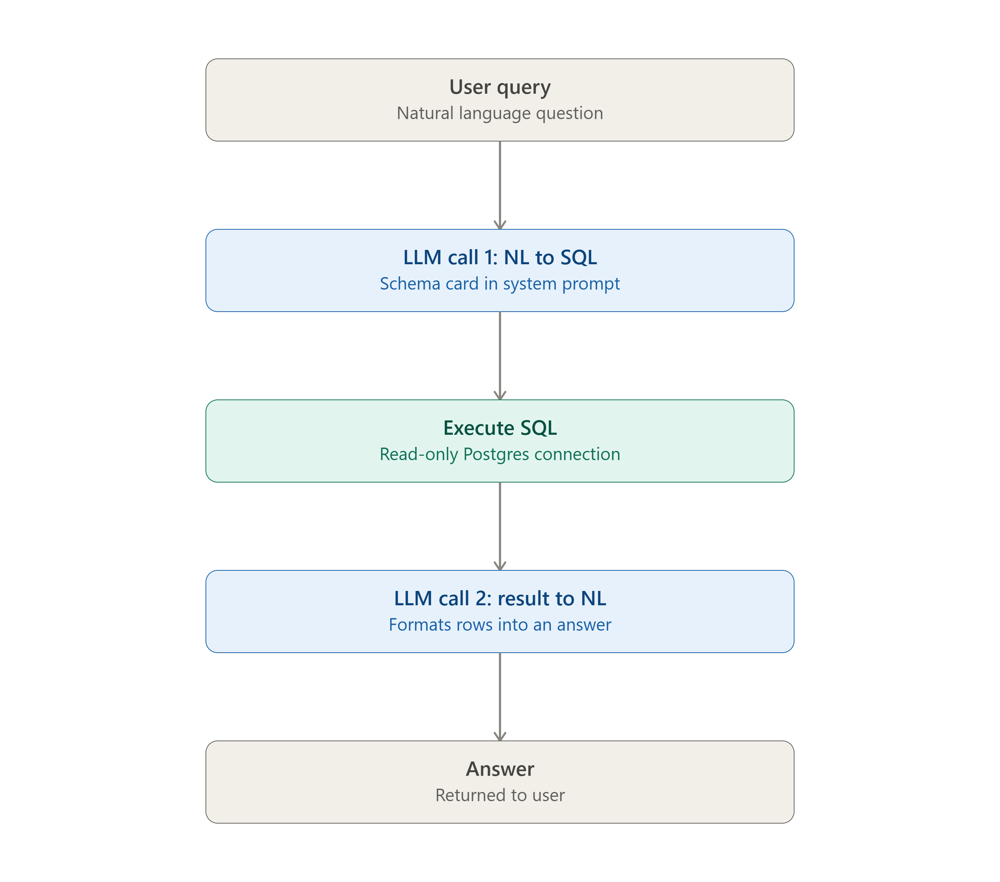
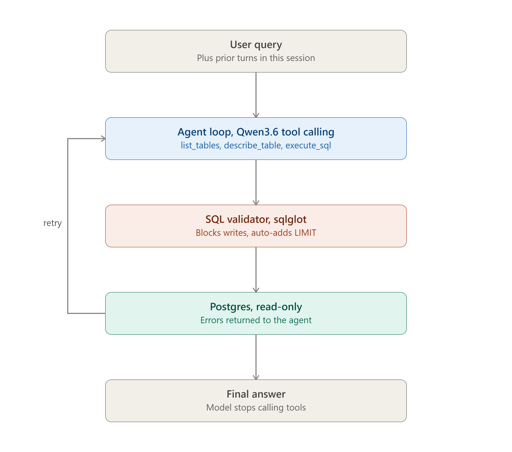
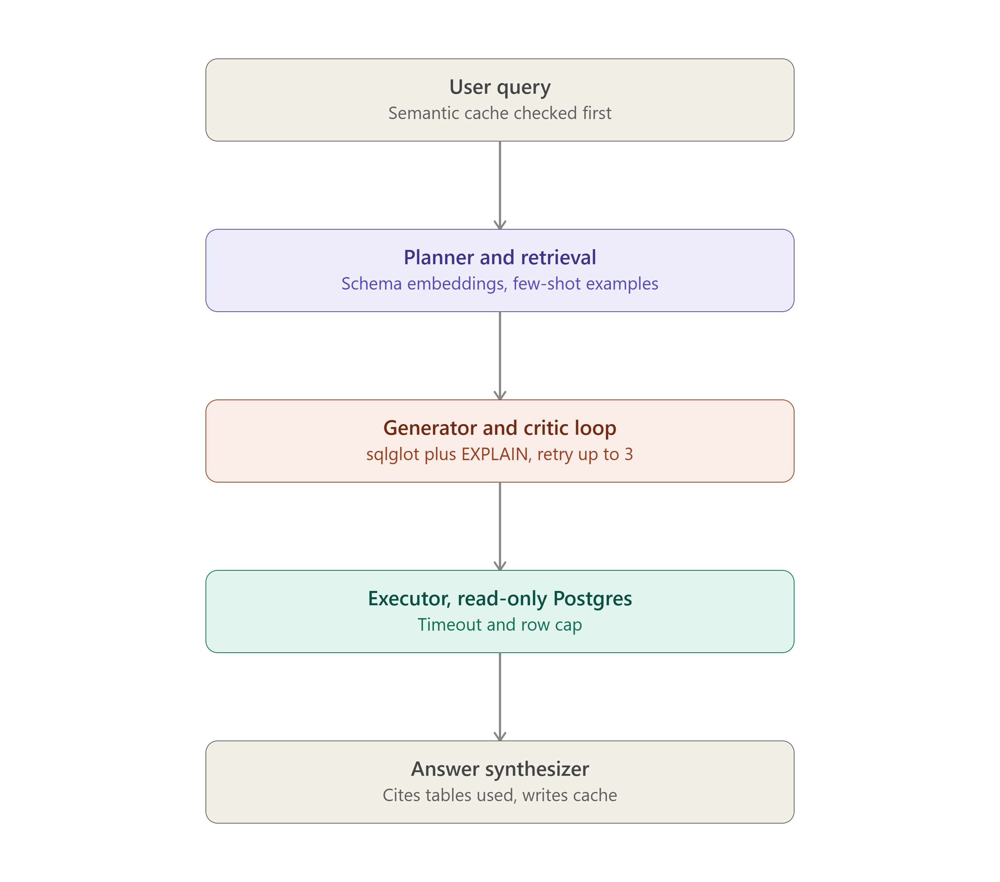

# SQL Agent

Three tiers differ on three real axes: how you give the model schema knowledge (static injection vs dynamic retrieval), how much control loop you build (single pass vs agentic loop vs multi-agent with a critic), and how much you invest in safety/evaluation. Here's how I'd stage it.

## Beginner: two-pass pipeline, static schema injection

No agent loop at all — just two LLM calls glued together by your own code. This gets you a working demo fastest and teaches the fundamentals (prompt-to-SQL parsing, safe execution) without any framework overhead.

- Once, at startup: build a "schema card" — table/column names, types, PK/FK, your 2-line table descriptions, and the dataset blurb — as one text block. TPC-H SF10 is only 8 tables, so this comfortably fits in-context.
- Call 1: `{schema card + instructions} + user question → Qwen3.6` generates one `SELECT` in a fenced code block. Extract it with a regex.
- Execute against Postgres using a **read-only** role (`GRANT SELECT` only), with `statement_timeout` set and an auto-injected `LIMIT` if the model forgets one.
- Call 2: `{question + SQL + result rows (as a small markdown table)} → Qwen3.6` produces the natural-language answer.
- No retry logic beyond maybe one blind retry if execution throws.## Intermediate: tool-calling agent with self-correction

## Intermediate: tool-calling agent with self-correction
This is where it becomes a real agent. Groq's chat completions and Responses APIs both support standard function calling: you define local tools, the model returns structured tool-call requests, your app executes them, and sends the results back for the next step. One useful wrinkle for your setup: Groq's Responses API doesn't yet support stateful conversations, so you keep and resend the message history yourself — same as chat completions, so pick whichever client feels cleaner and don't expect server-side thread state.

- Tools: `list_tables()`, `describe_table(name)` (columns, types, FKs, your 2-line description), `execute_sql(query)`.
- Agentic loop: model explores schema via tools, drafts SQL, calls `execute_sql`; on a Postgres error, the error message is fed back as the tool result and the model retries (cap at ~3 attempts).
- Validation layer before execution: use `sqlglot` to parse the query, reject anything that isn't a single `SELECT` (no `INSERT`/`UPDATE`/`DELETE`/`DDL`), auto-inject `LIMIT`, and check referenced tables/columns against the real schema so hallucinated columns get caught before they hit the DB.
- Multi-turn memory: keep the running message list per session so follow-ups ("now just for Q1 1994") work.
- Design for the free tier's rate limits from the start — Groq's free tier caps vary by model but generally impose per-minute and per-day request/token ceilings, for example around 30 requests per minute on several models with daily request and token caps — so wrap calls in backoff/retry and keep the tool loop tight (don't re-send the full schema on every turn if you can avoid it).## Advanced: multi-agent pipeline with retrieval, a critic, and evaluation

## Advanced: multi-agent pipeline with retrieval, a critic, and evaluation
This adds retrieval grounding, a verification step before execution, and — importantly for a free-tier setup — caching to conserve request budget, plus an evaluation harness so you can actually measure whether your prompt changes help.

- **Semantic cache**: embed the incoming question, check cosine similarity against past question→SQL pairs; skip the whole pipeline on a near-hit. Groq doesn't host embedding models, so run a small local one (`sentence-transformers/all-MiniLM-L6-v2` is fine) or even TF-IDF — at 8 tables you don't need anything heavy.
- **Planner + retrieval**: for complex multi-part questions, have the model decompose into sub-questions first. Embed your table/column descriptions and the 22 canonical TPC-H queries; retrieve the top-K relevant tables and few-shot examples per question. At TPC-H's scale this won't change accuracy much, but it's the pattern that generalizes to a schema with hundreds of tables.
- **Generator ↔ critic loop**: generate SQL, then before executing: parse with `sqlglot` (read-only, valid joins), run `EXPLAIN` (not `EXPLAIN ANALYZE`) to catch runaway cost estimates on SF10-sized tables, and if it fails, send the error back to the generator — bounded at ~3 attempts.
- **Executor**: read-only connection, `statement_timeout`, row cap.
- **Answer synthesizer**: turns the result set into NL, cites which tables/filters it used, optionally shows the SQL for transparency, and writes the accepted question→SQL pair into the cache.
- **Evaluation harness**: TPC-H ships 22 canonical queries with known semantics — write NL rephrasings of them as a golden set, and score execution accuracy (does your generated SQL's result set match the reference query's?) as a regression test every time you touch prompts.## A few things specific to your setup

- **Model/API**: use `qwen/qwen3.6-27b` with either `client.chat.completions.create(..., tools=...)` or `client.responses.create(..., tools=...)`, both OpenAI-client-compatible against `https://api.groq.com/openai/v1`. Remember the Responses API is stateless server-side right now — you resend history yourself either way.
- **DB safety, applies at every tier**: a dedicated read-only Postgres role, `statement_timeout`, and either an app-level `LIMIT` guard or `sqlglot`-based query validation. Don't skip this even at "beginner" — TPC-H SF10 has some tables (`lineitem`) large enough that an unbounded scan is a real footgun.
- **Rate limits**: free-tier limits vary by model, so check the current numbers on the console for `qwen/qwen3.6-27b` specifically before you lean on a tight retry loop — the intermediate/advanced tiers can burn requests fast during self-correction.

If I were you: build beginner first (a day, tops), it'll expose exactly where static schema injection breaks down for ambiguous questions. Then go straight to intermediate — that's the one that actually behaves like "an agent" and is the right complexity level for a portfolio/interview-story project. Advanced is worth doing only if you want to demonstrate retrieval-augmented generation and eval-driven iteration specifically; for an 8-table schema it's somewhat over-engineered on its own merits, but it's a legitimate showcase of patterns that matter at real scale.